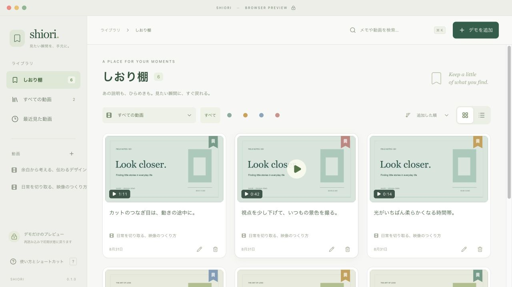

# Shiori

見たい瞬間に、しおりを。
Rust + Tauri 2 + React / TypeScriptで作る、macOS向けの軽量なローカル動画ビューワーです。
参考アプリのKoma（image-viewer）にならい、元の動画を変更せず、アプリ専用の記録を保存します。
最低OS設定はmacOS 12.3です。実機検証した環境はmacOS 26.5.1 / Apple Siliconです。
ダイアログなどに使う[Safari 15.4の機能](https://developer.apple.com/documentation/safari-release-notes/safari-15_4-release-notes)に合わせており、古いOSとIntel Macでの動作は未検証です。



自作サンプルによるブラウザプレビューです。実アプリの初回起動は空の棚から始まります。
プレイヤーの[ブラウザプレビュー](docs/screenshots/player-preview.png)と[macOS検証用アプリの画面](docs/screenshots/native-player-compact.png)も確認できます。

## 起動

ビルド済みの通常版は次の場所に生成されます。

```sh
open "target/release/bundle/macos/Shiori.app"
```

ソースから起動する場合は、Rust 1.95以降、Node.js 22.12以降、Xcode Command Line Toolsを用意してください。

```sh
npm ci
npm run app:dev
```

通常版のアプリをビルドする場合:

```sh
npm run app:build
```

個人利用向けのアドホック署名付き`.app`を生成します。
App Storeへの提出、Developer IDによる配布用署名、公証は行いません。

## できること

- 動画の特定時刻に、メモ・実フレームのサムネイル・色を付けて保存。
- 動画を横断する「しおり棚」。メモ・動画名・時刻の検索、動画や色による絞り込み、グリッド／リスト表示。
- しおりをクリックして、その時刻から再生。
- 10秒・30秒・1分の巻き戻しと早送り。動画の先頭／末尾を超えません。
- 0.1〜2.0倍の再生速度を0.1刻みで調整。
- 動画ごとの再生位置・再生速度を復元。
- 動画の複数追加、ドラッグ＆ドロップ、表示名の変更、ライブラリからの登録削除。
- 動画を移動した場合のファイル再指定。しおり・メモ・表示名・再生位置を引き継ぎます。
- 音量・ミュート・ウィンドウのフルスクリーン。
- 再生を続けたまま左右のパネルを隠す集中モード。`T`で切り替え、`Esc`で元の表示へ戻ります。集中モード中も右上のボタンや`B`でしおりを追加できます。
- A–B区間リピート。指定した説明や動きを繰り返し確認できます。

再生画面のヘッダーは1段にまとめ、再生コントロールは動画領域の幅に応じて1行または2行に配置します。コンテナクエリ未対応のWebKitでは2行で表示します。
保存状態は再生時刻の横に表示します。ショートカットの一覧は左下の「使い方とショートカット」から確認できます。

### 基本の使い方

1. 「動画を追加」または`⌘ O`で動画を選びます。複数選択やドロップも使えます。
2. 動画を開き、見返したい瞬間で「しおりを追加」または`B`を押します。
3. 再生を一時停止して、その瞬間のサムネイルを取得します。メモを書いて保存してください。
4. 「しおり棚」でメモを探し、カードを押すとその時間から再生します。

### 区間リピート

再生画面の「A–B」を押して設定を開きます。
繰り返したい位置でAを設定し、再生またはシークで進んでからBを設定すると、その区間のリピートが有効になります。
一時停止中に設定した場合は、再生ボタンで開始します。
区間は0.5秒以上で、タイムラインの上に範囲を表示します。
「リピート中」を押すと解除、「繰り返す」で再度有効になります。
区間外へのシーク・スキップ、地点しおりへのジャンプでも解除します。
「区間をしおりに保存」を押すと、AのサムネイルとA–Bの時刻をメモ付きで保存できます。
しおりの種類は「地点から再生」「A–B区間リピート」から選べます。編集で種類とBの時刻を変更できます。
区間しおりは、棚・動画横の一覧のどちらから開いても、Aからリピート再生します。
設定欄を閉じてもリピートは続きます。別の動画を開くと一時的な区間設定はリセットしますが、保存した区間しおりは再起動後も残ります。
折り返しは動画の再生イベントに従うため、フレーム単位の精度や音の継ぎ目の連続性は保証しません。

### キーボード

| 操作                   | キー                    |
| ---------------------- | ----------------------- |
| 動画を追加             | `⌘ O`                   |
| 棚を検索               | `⌘ K`                   |
| しおり棚へ戻る         | `⌘ L`                   |
| 再生／一時停止         | `Space`                 |
| 10秒戻る／進む         | `←` / `→`               |
| 30秒戻る／進む         | `Shift ←` / `Shift →`   |
| 1分戻る／進む          | `Option ←` / `Option →` |
| しおりを追加           | `B`                     |
| メモを保存             | 編集中に`⌘ Enter`       |
| 再生位置を保存／再試行 | `⌘ S`                   |
| フルスクリーン         | `F`                     |
| 集中モードの切り替え   | `T`                     |
| 集中モードを終了       | `Esc`                   |
| ヘルプ                 | `?`                     |

テキスト入力中、変換中、ダイアログ表示中は再生ショートカットを発動しません。
音量・シークバーはキーボードからも操作できます。

## ファイルと保存のルール

### 対応形式

MP4 / MOV / M4Vを登録できます。
実際に再生できる映像・音声コーデックはmacOSのWebKitに依存します。
H.264 + AACのMP4を検証用に使っています。
拡張子が対応していても、コーデックや破損によっては再生できません。
MKV・AVI、DRM付き動画、字幕ファイル、形式変換はこの版の対象外です。

再生にはシステムのWebViewを使用し、ChromiumやFFmpegの再生エンジンを同梱しません。
FFmpegは同梱デモを再生成する開発用スクリプトにのみ必要で、アプリの実行には不要です。
極端な低速再生時の音声の扱いも、システムの再生実装に依存します。

### データの場所

| 内容                         | 通常版の保存先                                                            |
| ---------------------------- | ------------------------------------------------------------------------- |
| 動画・しおり・メモ・再生位置 | `~/Library/Application Support/local.kazuki.shiori/videos/<UUID>.json`    |
| サムネイル                   | `~/Library/Application Support/local.kazuki.shiori/thumbnails/<UUID>.jpg` |

開発版は`local.kazuki.shiori.dev`以下に分離します。
各動画のJSONはバージョン付きで、一時ファイルへの書き込み・同期・アトミック置換で更新します。
1件が壊れても正常な動画は表示し、読み取れない記録は警告して残します。
同じ保存先を複数のアプリから同時に書き換えないよう、ファイルロックを取得します。

再生位置は再生中に約5秒ごと、一時停止・シーク・速度変更時に保存します。
動画や画面を切り替えるときと、ウィンドウを閉じる／`⌘ Q`で終了するときは、保存完了を待ちます。
失敗した場合は元の画面と未保存状態を維持し、移動・終了を止めます。
「再試行」または`⌘ S`で保存し直してください。
未保存メモのあるダイアログは、保存またはキャンセルしてから終了してください。
強制終了・電源断で、未書き込みの再生位置まで保存する保証はありません。

メモは1〜4,000文字、しおりは動画1本あたり10,000件までです。
JSONには64 MiB、サムネイル1枚には768 KiBの上限があります。
画面は少量ずつカードを追加表示し、サムネイルは遅延読み込みします。

### 動画の場所を変えたとき

1. 動画を開いた際の案内、または「動画の情報」から「ファイルの場所を再指定」を選びます。
2. 移動後の動画を選びます。
3. 元の動画と内容が一致すれば、保存先だけを更新します。

登録・再指定時は動画全体のBLAKE3ハッシュを、1 MiBのバッファで順に読み取って計算します。
大きな動画やネットワークドライブでは照合に時間がかかることがあります。
別内容の動画を選んだ場合やキャンセルした場合、以前の記録は変更しません。
再エンコードや内容編集された動画は同一とはみなしません。

同じ内容の動画を再登録しても重複は作りません。
元の場所が使えなくなっている場合は、新しく選択した同一内容の動画へ再接続します。
通常の再オープンではサイズ・更新時刻で確認し、変化を検出したときだけ全体を再照合します。
サイズと更新時刻を両方維持した書き換えを毎回検知するものではありません。
動画ファイルの常時監視・自動追跡は行いません。

### 削除とバックアップ

「登録を削除」はアプリ内の記録だけを削除します。
元動画を移動・編集・削除する処理はありません。
アプリ内の削除は取り消せないため、確認画面を表示します。
使われなくなったUUID名のサムネイルは削除時に整理します。
読み取れない記録がある場合は、その記録の復旧に備えてサムネイルの整理を止めます。
整理に失敗した画像は残り、次の削除操作で再試行します。

バックアップする場合はアプリを終了し、`videos`と`thumbnails`を含む保存フォルダ全体をコピーしてください。
JSONだけではサムネイルは復元できません。
同期・アカウント・クラウド送信・テレメトリーはありません。

### 動画を開けないときの診断

現在はRange応答上限を8 MiB（8,388,608バイト）に変更したv4です。変更前の復帰点は`f48956d`です。
Tauri 2.11.5の標準上限1,024,000バイトによって、実際の再生要求1,193,808バイトと1,713,768バイトが短縮されていました。上限だけを引き上げた比較ビルドで、ユーザーから同じ動画を再生できたとの確認を得ています。
TauriとWryの変更済みソースを`vendor/`に保存し、Git管理外の一時ファイルに依存しないようにしています。変更点と保守上の注意は[vendor/README.md](vendor/README.md)を参照してください。
Wryによる要求・応答・キャンセル・ネイティブ例外の記録は維持しています。
エラー画面の「詳細をコピー」には、実リクエストのログとこのアプリ自身のstderr末尾128 KiBを含みます。
ファイル名・パスは未加工なので、共有前に手動で伏せてください。ログ全体は表示された`nativeLog.file`にあります。
動画の映像・音声データはログに出力しません。別プロセスのWebKit／AVFoundationのシステムログはこの診断には含まれません。
この対応ではユーザー指定により自動テスト・lintを省略し、ビルド成功とユーザーによる再生確認を記録しています。

以下は復帰点のv2の説明です。

再生エラー画面には`Shiori playback diagnostics v2`の詳細を表示します。
ネイティブ版では、最大5秒でHTTPステータス・Content-Type・先頭／末尾のRange応答を確認し、詳細に追加します。
確認完了後に「詳細をコピー」を押すと、元のエラーと追加診断をまとめて共有できます。
ファイル名・保存パスは伏せます。動画の内容・タイトル・しおりのメモ・画像は診断に含めません。
この診断は再生エラー後の独立した確認であり、それだけで原因や再生可否を断定するものではありません。

## 開発と検証

```sh
npm run check
npm run format:check
git diff --check
```

`npm run dev`は`http://127.0.0.1:1421`でブラウザプレビューを起動します。
「デモを追加」を押すと、自作のサンプル動画だけを使う一時的な棚が表示されます。
ブラウザの変更はメモリ内だけで、再読み込みすると消えます。
ネイティブアプリの保存データや個人の動画は読みません。

同梱デモの再生成にはFFmpegとmacOSの標準フォントを使います。
既存の動画や画像は上書きしません。

```sh
npm run fixture
```

### 隔離したネイティブ検証

`app:dev`と`app:build:dev`は別IDの「Shiori Dev」を使用します。
通常版の`SHIORI_DATA_DIR`は引き継がず、開発版は`SHIORI_DEV_DATA_DIR`のみを参照します。
個人の動画や通常版の保存領域を検証に使わないでください。

```sh
npm run app:build:dev
shiori_test_root="$(mktemp -d /tmp/shiori-test.XXXXXX)"
cp public/demo/demo-0.mp4 "$shiori_test_root/sample.mp4"
SHIORI_DEV_DATA_DIR="$shiori_test_root/library" \
  "./target/release/bundle/macos/Shiori Dev.app/Contents/MacOS/shiori" \
  "$shiori_test_root/sample.mp4"
```

動画パスを起動引数で渡すと、その動画を登録します。
再起動後の復元を確認するときだけ、同じ検証用フォルダを再利用してください。
macOSのシステムダイアログ、WebKitの実再生、移動後の再指定はネイティブ版でも確認する必要があります。
ブラウザやモックを使ったテストだけでは、これらの確認を代替できません。

## 構成

```text
src/features/              しおり棚・プレイヤー・メモ編集
src/app/                   画面遷移・操作の調整・終了処理
src/application/           保存キュー・フレーム取得
src/domain/                型・時刻計算・検索
src/platform/              Tauri IPC / 一時的なブラウザプレビュー
src-tauri/                 macOSウィンドウ・ファイル権限・IPC
crates/shiori-core/        保存契約・動画照合・メタデータ・サムネイル
```

詳細は[設計](docs/architecture.md)と[検証記録](docs/verification.md)を参照してください。

## 参照した一次資料

- [Tauri 2のアセットURLとファイルスコープ](https://v2.tauri.app/reference/javascript/api/namespacecore/#convertfilesrc)
- [Tauriの標準アセットプロトコルとRange処理](https://docs.rs/tauri/latest/src/tauri/protocol/asset.rs.html)
- [Tauriのネイティブファイル選択](https://v2.tauri.app/plugin/dialog/)
- [AppleのWebKit動画再生ガイド](https://developer.apple.com/documentation/webkit/delivering-video-content-for-safari)
